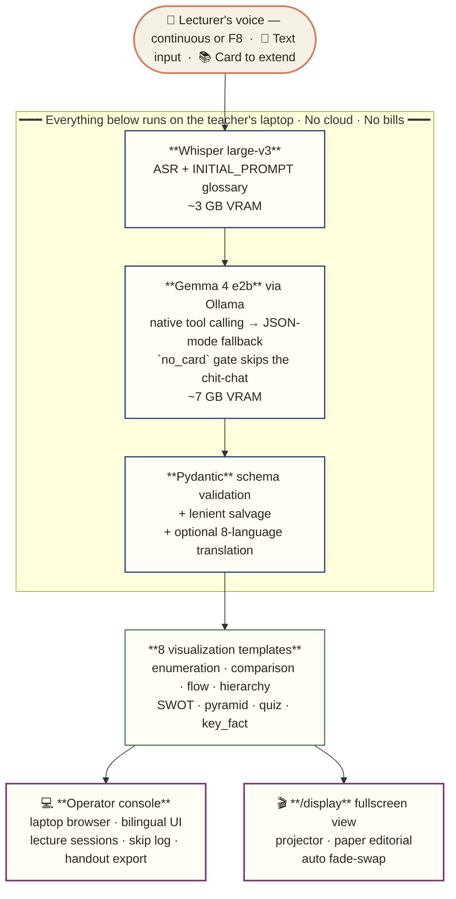
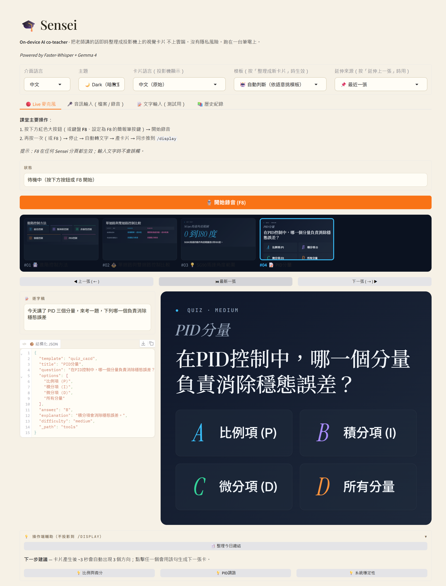
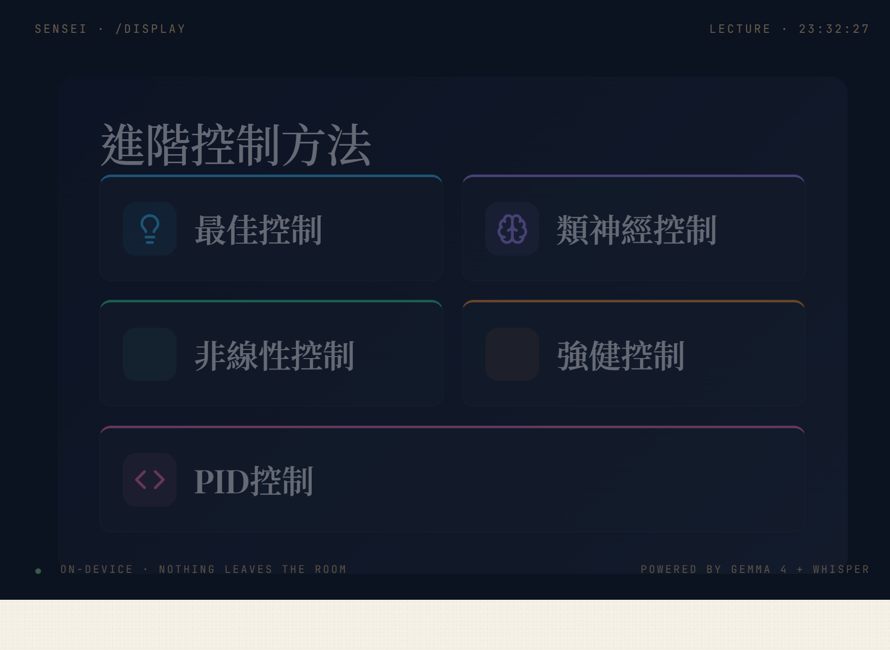
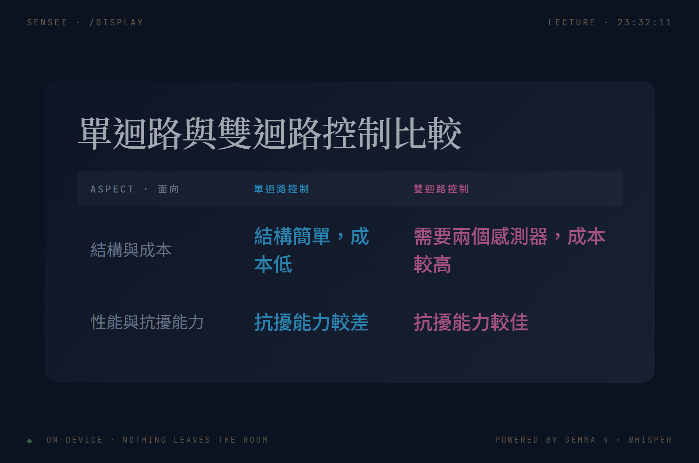
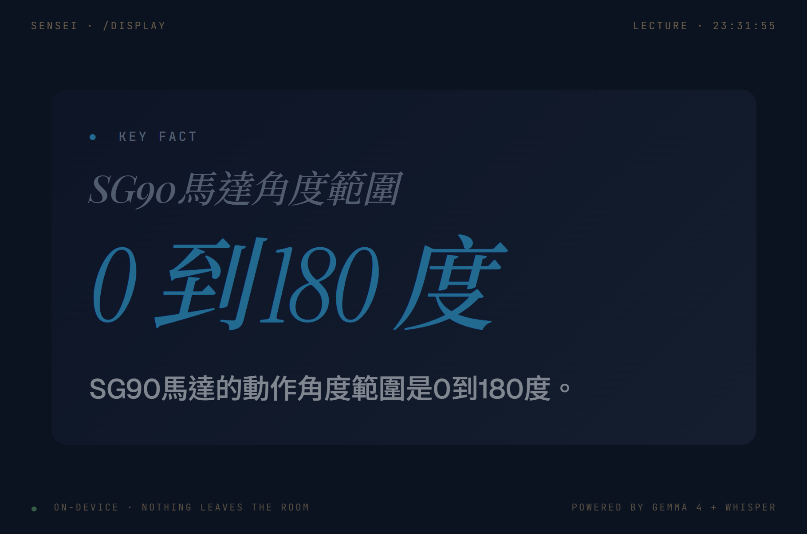
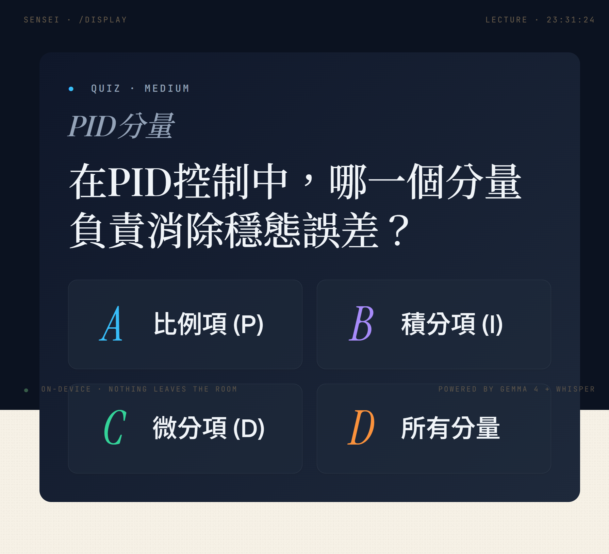

<p align="center">
  
</p>

# 🎙️ Sensei

[](https://www.kaggle.com/competitions/gemma-4-good-hackathon/)
[](https://creativecommons.org/licenses/by/4.0/)
[](https://www.python.org)
[](https://www.kaggle.com/models/google/gemma-4)
[](https://ollama.com)
[](https://github.com/openai/whisper)

> **An on-device AI co-teacher that turns a lecturer's spoken words into structured visual cards in real time. No cloud. No privacy risk. Runs on a single laptop.**

*Built for the [Gemma 4 Good Hackathon](https://www.kaggle.com/competitions/gemma-4-good-hackathon/) (May 2026, see [Hackathon history](#hackathon-history)) · now developed for real weekly classroom use · roadmap in [PROJECT_ENHANCEMENT_PROPOSAL.md](PROJECT_ENHANCEMENT_PROPOSAL.md)*

---

## Architecture at a glance



Four layers of structured-output guarantee, top to bottom: native function calling → JSON mode → Pydantic → lenient salvage. See [WRITEUP §3](WRITEUP.md#3-architecture) for the full reasoning.

## Screenshots

Four real-app captures of the running Sensei pipeline (Whisper → Gemma 4 e2b → Pydantic → paper-editorial renderer). No stylization — these are direct `localhost:7860` screenshots.

### Operator console (laptop)

<p align="center">
  
</p>

### `/display` (projector — read-only fullscreen view)

| Template | Capture | Trigger phrase |
|---|---|---|
| `enumeration_cards` |  | *"控制不是只有 PID，還有最佳、類神經、非線性、強健"* |
| `comparison_table` |  | *"我們比較一下單迴路與雙迴路控制…"* |
| `key_fact` |  | *"Arduino 的 SG90 動作角度範圍是 0 到 180 度…"* (single-concept utterances ↦ this template) |
| `quiz_card` |  | *"來考一題、quick check…"* (spoken-trigger guard short-circuits the classifier) |

`/display` is the read-only mirror the teacher projects onto the classroom screen; the operator console drives it. Notice in the quiz card that **the correct answer is intentionally absent** from the projection so the teacher controls reveal pacing — the answer lives in the operator-side JSON view only.

---

## The problem

Every classroom has the same gap: the teacher *says* rich, structured ideas — *"control isn't only PID; there's also optimal, neural, nonlinear, robust control"* — but what the students *see* is a static slide that took the teacher hours to make, or a whiteboard scribble. The structure is in the teacher's head, not on the screen.

Closing this gap with cloud AI hits three walls:

1. **Privacy.** Many jurisdictions forbid sending classroom audio (especially with student voices) to third-party servers.
2. **Cost.** A teacher in a low-budget school district can't afford per-token API bills for every lecture.
3. **Latency.** Real-time visualization needs <2s round-trip. Cloud LLMs add 2–3s of network jitter alone.

Sensei runs **entirely on the teacher's laptop**. No audio leaves the room. No bills. ~1 second from speech to visual.

## How it works

```
🎤 Teacher speaks
    ↓
Faster-Whisper large-v3 (local)              ← transcribes Mandarin + engineering jargon
    ↓
Gemma 4 (local, via Ollama, JSON-constrained) ← classifies intent + fills template
    ↓
Pydantic schema validation                    ← guarantees parseable structure every time
    ↓
Two simultaneous views:
  • Operator console (Gradio)                 ← teacher's laptop
  • /display fullscreen view (SSE push)       ← classroom projector
```

Eight visualization templates cover the most common pedagogical speech patterns:

| Template | When | Example trigger | Status |
|---|---|---|---|
| `enumeration_cards` | Listing parallel concepts | *"Control has PID, optimal, neural, nonlinear, robust"* | shipped |
| `comparison_table` | Comparing two things | *"Open-loop vs closed-loop differs in..."* | shipped |
| `flow_diagram` | Sequential steps | *"First measure, then compare, then actuate"* | shipped |
| `hierarchy_tree` | Classifying with sub-classes | *"Linear control includes P, PI, PID..."* | shipped |
| `swot` | SWOT analysis (2x2 strategic grid) | *"Let's SWOT this strategy..."* | shipped |
| `pyramid` | Linear hierarchy from apex to base | *"Maslow's hierarchy: physiological at base..."* | shipped |
| `quiz_card` | In-lecture formative check (4-option MCQ) | *"Quick check — which of these is NOT..."* | shipped |
| `key_fact` | Single-concept spotlight (definitions, numbers, specs) | *"SG90 motor range is 0 to 180 degrees..."* | shipped |

`quiz_card` has a **spoken trigger guard**: phrases like *"來考一題"*, *"考考大家"*, *"quick check"* hard-force the template before the LLM classifies, so the in-class flow is deterministic — the teacher speaks naturally and the quiz card appears.

### Beyond the basics

- **Continuous listening** — press once at the start of the lecture and put the keyboard down. Sensei segments its own utterances (a pause over 1.2 s ends one; under 3 s is discarded) and runs a two-layer gate before anything reaches the projector: a rule layer drops utterances too short to carry structure, and an 8th tool, `no_card`, lets Gemma 4 say "this one is chit-chat". Skipped utterances are listed on the console only — students never see them. F8 stays as the manual override: while listening, it cuts the current utterance immediately instead of waiting for the pause.
- **Lecture sessions and handout export** — name the course once, and every card of that lecture lands in `history/<date>_<course>/`. One click writes a `handout.html` for that lecture: summary first, then the cards in order, each with the lecturer's own words folded underneath. Self-contained, no JS, prints to PDF from the browser. This is what makes Sensei worth opening after class as well as during it.
- **Second screen (`/display`)** — a separate fullscreen URL that fades to the latest card the moment it exists (Server-Sent Events, 1 s polling as fallback). Teacher mirrors it to the projector while operating Gradio on the laptop.
- **Course glossary + lecture language** — pick the Whisper term glossary for today's course (`glossaries/*.txt`, add your own without touching code) and the lecture language (中文 / English / auto). English lectures get English cards directly.
- **History** — every card auto-saves as both `.json` (data + transcript + which gate decided it) and `.html` (standalone, screenshot-able), into the active lecture's directory.
- **Card extension** — the lecturer can say *"oh, also add robust control and gain scheduling"* and click "Extend last card" to append items to an existing card without rebuilding from scratch. Template is locked to the original card's template.
- **Template hint** — operator can force a specific template (override LLM's auto-pick) when the natural-language signal is ambiguous.
- **Large-print mode by design** — all card text is ≥24 px, key headings ≥36 px, sized for projector legibility from the back of a classroom.

## Why Gemma 4 specifically

This is the answer to *"why not just use a cloud LLM?"*:

1. **Open weights, classroom-deployable.** Gemma's license permits commercial and educational use without per-call fees, so any teacher can deploy Sensei locally and ship it forward to the next classroom — the privacy/cost story is real, not aspirational.
2. **Edge-friendly sizes.** The `e2b` variant (~7 GB) and `e4b` variant (~10 GB) both fit on a laptop GPU. Edge models exist precisely for scenarios like classrooms.
3. **Native JSON / structured output.** Sensei needs *structured* output (JSON conforming to a fixed schema), not free-form text. Gemma 4 via Ollama enforces this at the sampling level — invalid JSON is *unproducible*. A Pydantic post-validation pass is the second safety net.
4. **Multimodal capability, deliberately deferred.** Gemma 4 can see and hear; whiteboard capture was evaluated and shelved because it needs extra hardware and forces a model swap against Whisper on a 12 GB GPU (see [WRITEUP §8](WRITEUP.md#8-roadmap-and-honest-limits)). It can be re-enabled for rooms that already have a board camera.

## Quick start

### 1. Install Ollama and pull Gemma 4

Download Ollama: https://ollama.com (Windows/macOS/Linux)

```bash
ollama pull gemma4:e2b      # 7.2 GB — recommended on 12 GB GPUs
# or
ollama pull gemma4:e4b      # 9.6 GB — higher quality, needs more VRAM
```

Verify:

```bash
ollama list
# should show gemma4:e2b
```

### 2. Install PyTorch with CUDA (for Faster-Whisper)

```bash
pip install torch --index-url https://download.pytorch.org/whl/cu121
```

### 3. Install Sensei dependencies

```bash
pip install -r requirements.txt
```

### 4. Smoke-test each module independently

Make sure Ollama is running first (the Ollama desktop app or `ollama serve`).

```bash
# 4a. Test LLM alone (no audio yet)
python -m core.llm "同學，控制不是只有 PID 控制，還有最佳、類神經、非線性、強健"

# Expected: a JSON object with "template": "enumeration_cards" and 5 items.

# 4b. Test ASR alone (any wav file)
python -m core.asr path/to/test.wav

# 4c. Test full pipeline (text mode, no mic)
python -m core.pipeline "風機監控系統的流程是先量測振動，再特徵抽取，然後分類，最後報警"

# 4d. See how the continuous-listening segmenter behaves (no mic, no models)
python -m bench.segmenter_probe
```

### 5. Launch Sensei

```powershell
.\start_sensei.ps1
# checks Ollama + gemma4:e2b, starts the app, opens the operator console and /display
```

or, on any OS:

```bash
python -m frontend.app
# operator console: http://localhost:7860
# projector view:   http://localhost:7860/display  (F11 for fullscreen)
```

## VRAM budget on RTX 4080 (12 GB)

| Component | VRAM |
|---|---|
| Faster-Whisper large-v3 (fp16) | ~3.0 GB |
| Gemma 4 e2b (Ollama, q4) | ~7.0 GB |
| PyTorch + CUDA overhead | ~1.0 GB |
| **Total** | **~11 GB** |

If VRAM tight: switch ASR to medium (1.5 GB) in `core/asr.py`.
If quality priority: switch model to `gemma4:e4b` in `core/llm.py` AND ASR to medium.

## Project structure

```
sensei/
├── core/
│   ├── asr.py           ← Faster-Whisper wrapper; language + glossary switchable at runtime
│   ├── glossary.py      ← loads glossaries/*.txt into Whisper initial_prompts
│   ├── llm.py           ← Gemma 4 via Ollama, tool calling + JSON-mode fallback, zh/en output
│   ├── templates.py     ← 7 visualization schemas (Pydantic)
│   ├── pipeline.py      ← end-to-end glue + quiz_card spoken-trigger + the no-card gate
│   ├── live_mic.py      ← F8 toggle capture + continuous listening (VAD-style segmenter)
│   └── session.py       ← one directory per lecture (history/<date>_<course>/)
├── frontend/
│   ├── app.py           ← Gradio operator console: layout, handlers, history
│   ├── renderers.py     ← THEMES + 7 HTML renderers (≥24 px / ≥36 px large-print rule)
│   ├── i18n.py          ← operator-UI strings (zh / en)
│   ├── display.py       ← /display projector page, SSE feed, FastAPI mount
│   └── handout.py       ← a lecture directory → one printable handout.html
├── glossaries/          ← one ASR glossary per course (auto_control, machine_learning, wind_energy, general.en)
├── prompts/
│   ├── classifier.txt   ← Gemma 4's instruction (template choice + slot filling)
│   └── extender.txt     ← prompt for "extend existing card with new content"
├── bench/               ← measurement, not tests (segmenter tuning probe)
├── start_sensei.ps1     ← one-click launcher (Windows)
├── dry_run.ps1          ← 9-step preflight check
├── PROJECT_ENHANCEMENT_PROPOSAL.md ← post-hackathon roadmap (start here)
├── WRITEUP.md           ← hackathon writeup (archived)
├── requirements.txt
└── README.md            ← you are here
```

## Hackathon history

Sensei was built in nine days (2026-05-09 → 05-18) for the Gemma 4 Good Hackathon and submitted to the Main Track, the Future of Education impact prize and the Ollama special-technology prize. **It did not place.** Everything the submission contained still works and is documented in [WRITEUP.md](WRITEUP.md) (archived as submitted) and [DEMO_SCRIPT.md](DEMO_SCRIPT.md).

The project continues with a different yardstick: not "does the demo video land", but "does the teacher open it next week". The roadmap, the tech-debt list and the open decisions are in [PROJECT_ENHANCEMENT_PROPOSAL.md](PROJECT_ENHANCEMENT_PROPOSAL.md).

## License

This work is licensed under [Creative Commons Attribution 4.0 International (CC-BY 4.0)](https://creativecommons.org/licenses/by/4.0/), as required by the Gemma 4 Good Hackathon official rules (§1.6 + §2.5.a).

Bundled / runtime models retain their upstream licenses:
- **Gemma 4** weights — Google's Gemma license terms.
- **Whisper large-v3** weights via Faster-Whisper — MIT (model + library).
- All other Python dependencies retain their original OSI-approved licenses.

---

*Sensei · 先生 — built so any teacher, anywhere, can have a co-teacher.*
