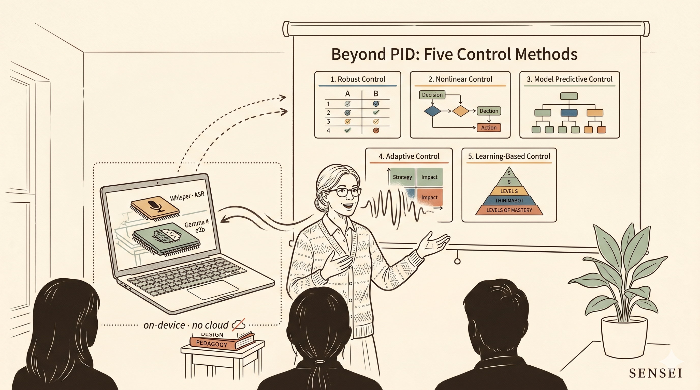
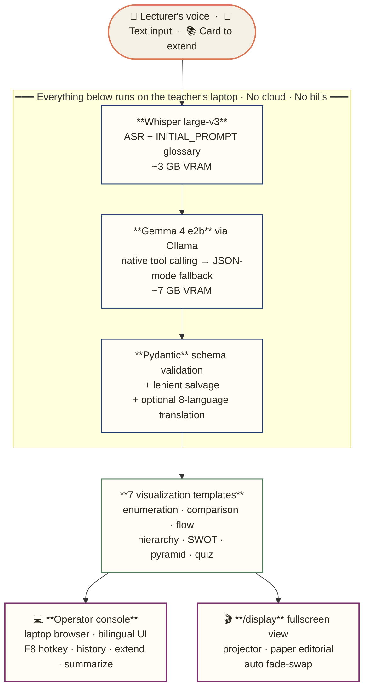

<p align="center">
  
</p>

# 🎙️ Sensei

[](https://www.kaggle.com/competitions/gemma-4-good-hackathon/)
[](https://creativecommons.org/licenses/by/4.0/)
[](https://www.python.org)
[](https://www.kaggle.com/models/google/gemma-4)
[](https://ollama.com)
[](https://github.com/openai/whisper)

> **An on-device AI co-teacher that turns a lecturer's spoken words into structured visual cards in real time. No cloud. No privacy risk. Runs on a single laptop.**

*Submission for the [Gemma 4 Good Hackathon](https://www.kaggle.com/competitions/gemma-4-good-hackathon/) · self-nominated for **Main Track** + **Future of Education** Impact Prize + **Ollama** Special Technology Prize · May 18, 2026*

---

## Architecture at a glance



Three layers of structured-output guarantee, top to bottom: native function calling → JSON mode → Pydantic with salvage. See [WRITEUP §3](WRITEUP.md#3-architecture) for the full reasoning.

---

## Screenshots

> 4 stills from the running app are captured during the **Day 7 classroom shoot** (2026-05-15) and dropped into [`docs/screenshots/`](docs/screenshots/). Until then, the demo video below is the canonical visual reference.
>
> The **3-minute demo video** is uploaded after the Day 7 shoot — link will appear here and on the [Kaggle submission page](https://www.kaggle.com/competitions/gemma-4-good-hackathon/).

---

## The problem

Every classroom has the same gap: the teacher *says* rich, structured ideas — *"control isn't only PID; there's also optimal, neural, nonlinear, robust control"* — but what the students *see* is a static slide that took the teacher hours to make, or a whiteboard scribble. The structure is in the teacher's head, not on the screen.

Closing this gap with cloud AI hits three walls:

1. **Privacy.** Many jurisdictions forbid sending classroom audio (especially with student voices) to third-party servers.
2. **Cost.** A teacher in a low-budget school district can't afford per-token API bills for every lecture.
3. **Latency.** Real-time visualization needs <2s round-trip. Cloud LLMs add 2–3s of network jitter alone.

Sensei runs **entirely on the teacher's laptop**. No audio leaves the room. No bills. ~1 second from speech to visual.

## How it works

```
🎤 Teacher speaks
    ↓
Faster-Whisper large-v3 (local)              ← transcribes Mandarin + engineering jargon
    ↓
Gemma 4 (local, via Ollama, JSON-constrained) ← classifies intent + fills template
    ↓
Pydantic schema validation                    ← guarantees parseable structure every time
    ↓
Two simultaneous views:
  • Operator console (Gradio)                 ← teacher's laptop
  • /display fullscreen view (auto-updating)  ← classroom projector
```

Seven visualization templates cover the most common pedagogical speech patterns:

| Template | When | Example trigger | Status |
|---|---|---|---|
| `enumeration_cards` | Listing parallel concepts | *"Control has PID, optimal, neural, nonlinear, robust"* | shipped |
| `comparison_table` | Comparing two things | *"Open-loop vs closed-loop differs in..."* | shipped |
| `flow_diagram` | Sequential steps | *"First measure, then compare, then actuate"* | shipped |
| `hierarchy_tree` | Classifying with sub-classes | *"Linear control includes P, PI, PID..."* | shipped |
| `swot` | SWOT analysis (2x2 strategic grid) | *"Let's SWOT this strategy..."* | shipped |
| `pyramid` | Linear hierarchy from apex to base | *"Maslow's hierarchy: physiological at base..."* | shipped |
| `quiz_card` | In-lecture formative check (4-option MCQ) | *"Quick check — which of these is NOT..."* | shipped |

`quiz_card` has a **spoken trigger guard**: phrases like *"來考一題"*, *"考考大家"*, *"quick check"* hard-force the template before the LLM classifies, so the in-class flow is deterministic — the teacher speaks naturally and the quiz card appears.

### Beyond the basics

- **Second screen (`/display`)** — a separate fullscreen URL that auto-fades to the latest card. Teacher mirrors it to the projector while operating Gradio on the laptop.
- **History** — every card auto-saves to `history/` as both `.json` (data + transcript) and `.html` (standalone, screenshot-able).
- **Card extension** — the lecturer can say *"oh, also add robust control and gain scheduling"* and click "Extend last card" to append items to an existing card without rebuilding from scratch. Template is locked to the original card's template.
- **Template hint** — operator can force a specific template (override LLM's auto-pick) when the natural-language signal is ambiguous.
- **Large-print mode by design** — all card text is ≥24 px, key headings ≥36 px, sized for projector legibility from the back of a classroom.

## Why Gemma 4 specifically

This is the answer to *"why not just use a cloud LLM?"*:

1. **Open weights, classroom-deployable.** Gemma's license permits commercial and educational use without per-call fees, so any teacher can deploy Sensei locally and ship it forward to the next classroom — the privacy/cost story is real, not aspirational.
2. **Edge-friendly sizes.** The `e2b` variant (~7 GB) and `e4b` variant (~10 GB) both fit on a laptop GPU. Edge models exist precisely for scenarios like classrooms.
3. **Native JSON / structured output.** Sensei needs *structured* output (JSON conforming to a fixed schema), not free-form text. Gemma 4 via Ollama enforces this at the sampling level — invalid JSON is *unproducible*. A Pydantic post-validation pass is the second safety net.
4. **Multimodal capability.** Phase 2 will add image input — point a webcam at the whiteboard, let Sensei integrate the chalk diagram with the spoken explanation.

## Quick start

### 1. Install Ollama and pull Gemma 4

Download Ollama: https://ollama.com (Windows/macOS/Linux)

```bash
ollama pull gemma4:e2b      # 7.2 GB — recommended on 12 GB GPUs
# or
ollama pull gemma4:e4b      # 9.6 GB — higher quality, needs more VRAM
```

Verify:

```bash
ollama list
# should show gemma4:e2b
```

### 2. Install PyTorch with CUDA (for Faster-Whisper)

```bash
pip install torch --index-url https://download.pytorch.org/whl/cu121
```

### 3. Install Sensei dependencies

```bash
pip install -r requirements.txt
```

### 4. Smoke-test each module independently

Make sure Ollama is running first (the Ollama desktop app or `ollama serve`).

```bash
# 4a. Test LLM alone (no audio yet)
python -m core.llm "同學，控制不是只有 PID 控制，還有最佳、類神經、非線性、強健"

# Expected: a JSON object with "template": "enumeration_cards" and 5 items.

# 4b. Test ASR alone (any wav file)
python -m core.asr path/to/test.wav

# 4c. Test full pipeline (text mode, no mic)
python -m core.pipeline "風機監控系統的流程是先量測振動，再特徵抽取，然後分類，最後報警"
```

### 5. Launch the Gradio app

```bash
python -m frontend.app
# open http://localhost:7860
```

## VRAM budget on RTX 4080 (12 GB)

| Component | VRAM |
|---|---|
| Faster-Whisper large-v3 (fp16) | ~3.0 GB |
| Gemma 4 e2b (Ollama, q4) | ~7.0 GB |
| PyTorch + CUDA overhead | ~1.0 GB |
| **Total** | **~11 GB** |

If VRAM tight: switch ASR to medium (1.5 GB) in `core/asr.py`.
If quality priority: switch model to `gemma4:e4b` in `core/llm.py` AND ASR to medium.

## Project structure

```
sensei/
├── core/
│   ├── asr.py           ← Faster-Whisper wrapper, domain glossary
│   ├── llm.py           ← Gemma 4 via Ollama, tool calling + JSON-mode fallback
│   ├── templates.py     ← 7 visualization schemas (Pydantic)
│   └── pipeline.py      ← end-to-end glue + quiz_card spoken-trigger guard
├── frontend/
│   ├── app.py           ← Gradio operator console + 7 HTML renderers + /display route
│   └── ...
├── prompts/
│   ├── classifier.txt   ← Gemma 4's instruction (template choice + slot filling)
│   └── extender.txt     ← prompt for "extend existing card with new content"
├── requirements.txt
└── README.md            ← you are here
```

## 9-day plan (May 9 → May 18)

- [x] **Day 1 (5/9):** Core pipeline skeleton + Gradio MVP, Ollama backend
- [x] **Day 2 (5/9 evening):** Real Lucide icons; second-screen `/display` view; history / extend / template-hint features; large-print rule (≥24 px / ≥36 px)
- [x] **Day 3 (5/9 cont):** Theme switching (dark / light / paper); SWOT and pyramid templates; 8-language projection
- [x] **Day 3 (5/11):** Live mic + F8 hotkey (record / stop / auto-transcribe → push to `/display`)
- [x] **Day 3+ (5/11 evening):** `quiz_card` template + Mandarin/English spoken-trigger guard for deterministic in-class quiz flow
- [x] **Day 5 (folded into Day 1–2):** Native Gemma 4 function-calling — already the primary path; JSON-mode kept as silent fallback
- [x] **Day 4 (folded into 5/11):** Real classroom audio testing pass via live mic; multiple takes; remaining ASR misses are pronunciation-side, not Gemma 4-side
- [ ] **Day 6 (5/14):** Full dry-run on the projector + external-mic rig per [DEMO_SCRIPT.md](DEMO_SCRIPT.md)
- [ ] **Day 7 (5/15):** **Real classroom shoot for demo video** — the critical day
- [ ] **Day 8 (5/16):** Edit demo video; finalize [WRITEUP.md](WRITEUP.md)
- [ ] **Day 9 (5/17):** Buffer / README polish / writeup final pass
- [ ] **Day 10 (5/18):** Submit by 23:59 UTC

## License

This work is licensed under [Creative Commons Attribution 4.0 International (CC-BY 4.0)](https://creativecommons.org/licenses/by/4.0/), as required by the Gemma 4 Good Hackathon official rules (§1.6 + §2.5.a).

Bundled / runtime models retain their upstream licenses:
- **Gemma 4** weights — Google's Gemma license terms.
- **Whisper large-v3** weights via Faster-Whisper — MIT (model + library).
- All other Python dependencies retain their original OSI-approved licenses.

---

*Sensei · 先生 — built so any teacher, anywhere, can have a co-teacher.*
